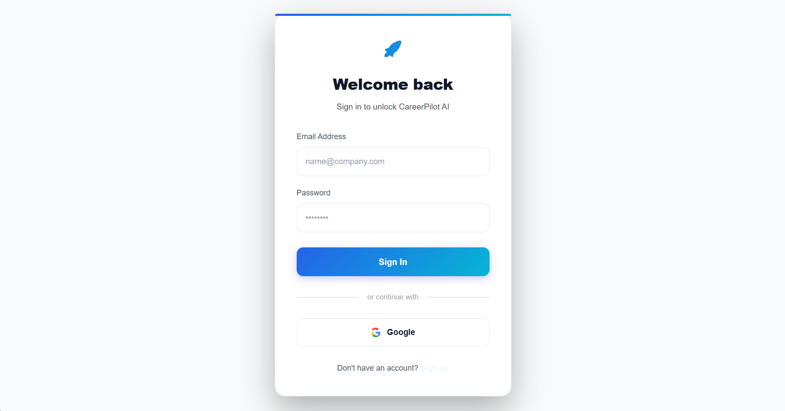
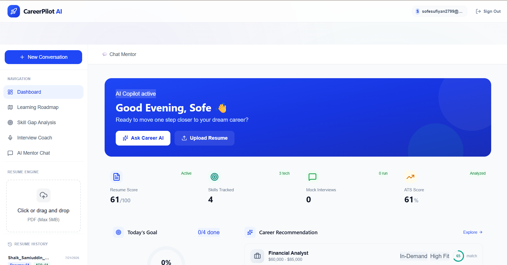
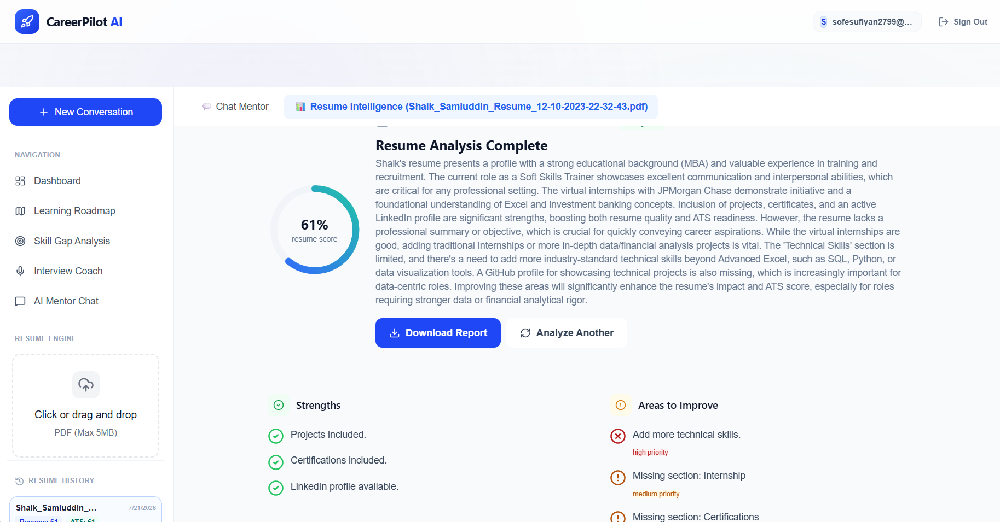
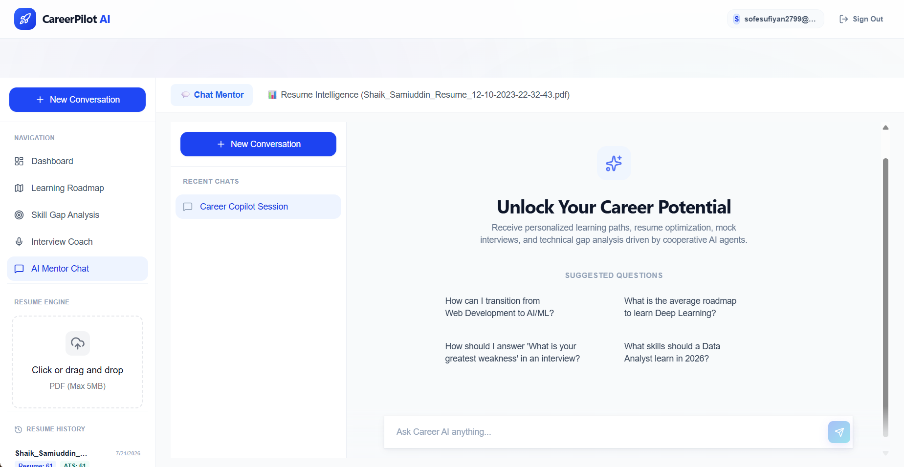
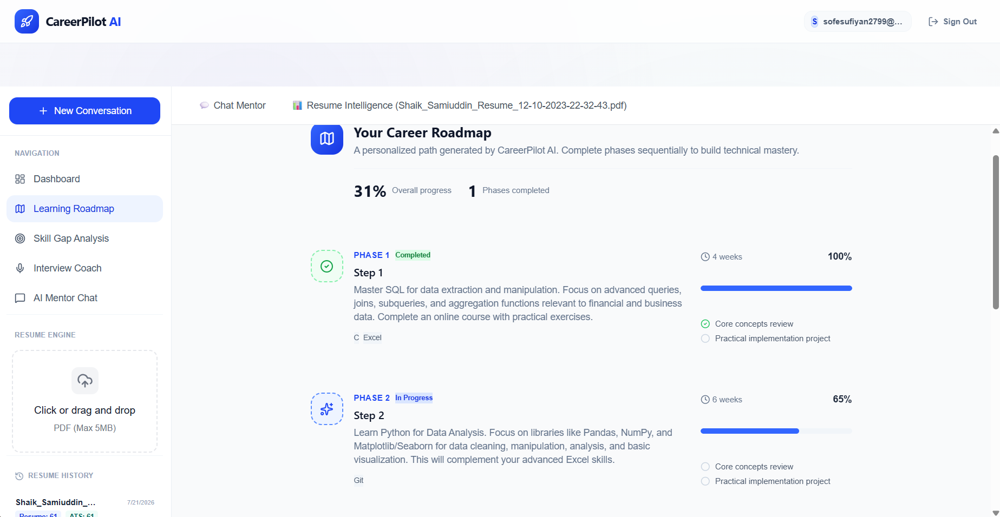
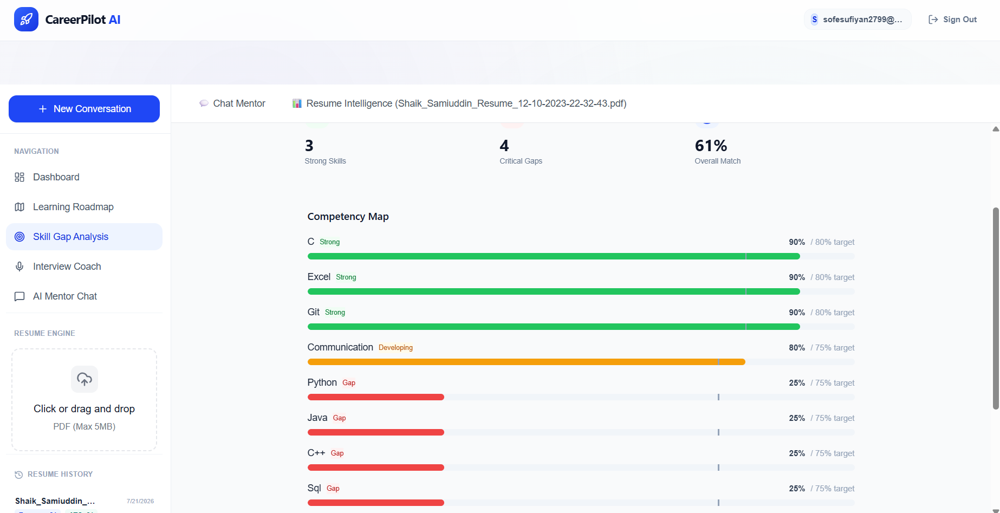
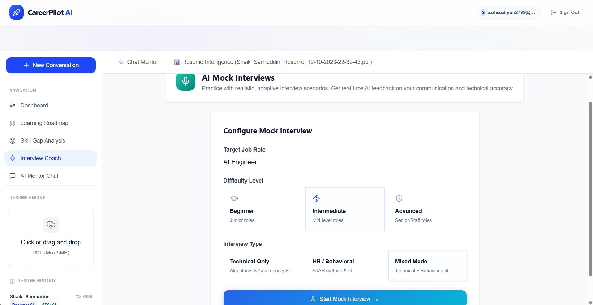

# 🚀 CareerPilot AI

> An AI-powered career guidance platform that helps students and job seekers analyze resumes, identify skill gaps, receive personalized career advice, generate learning roadmaps, and prepare for interviews using Generative AI.

---

## 🌟 Overview

CareerPilot AI is an intelligent career mentor built with modern AI technologies. It combines resume analysis, AI-powered career guidance, interview coaching, skill gap analysis, and personalized learning roadmaps into one platform.

The application is designed to help students and professionals make informed career decisions through interactive AI assistance and data-driven insights.

## ✨ Features

- 🔐 Secure Authentication (Email/Password & Google Sign-In)
- 📄 AI Resume Analysis & ATS Score
- 🤖 AI Career Mentor Chat
- 🛣️ Personalized Learning Roadmap
- 🎯 Skill Gap Analysis
- 💼 AI Interview Coach
- 📊 Interactive Career Dashboard
- 📥 PDF Resume Upload
- ☁️ Firebase Authentication
- ⚡ FastAPI Backend
- 🧠 Gemini AI Integration
- 📱 Responsive Modern UI

## 🛠️ Tech Stack

### Frontend
- React.js
- Vite
- Tailwind CSS
- React Router
- Lucide React

### Backend
- FastAPI
- Python
- Uvicorn

### AI & Machine Learning
- Google Gemini API
- Google ADK
- MCP (Model Context Protocol)

### Authentication
- Firebase Authentication
- Google OAuth

### Database & Storage
- Firebase

### Deployment
- Vercel (Frontend)
- FastAPI Deployment (Render/Railway or your chosen platform)

### Version Control
- Git
- GitHub

## 🏗️ System Architecture

```text
                +---------------------------+
                |        React + Vite       |
                |      (Frontend UI)        |
                +------------+--------------+
                             |
                             |
                  Firebase Authentication
                             |
                             |
                +------------v--------------+
                |      FastAPI Backend      |
                |    (Business Logic/API)   |
                +------------+--------------+
                             |
          +------------------+------------------+
          |                  |                  |
          |                  |                  |
   Resume Analysis     Interview Coach    Career Mentor
          |                  |                  |
          +------------------+------------------+
                             |
                             |
                    Google Gemini API
                             |
                             |
                     AI Generated Results
```

# 📸 Project Screenshots

## 🏠 Landing Page


---

## 🔐 Login Page


---

## 📊 Dashboard



---

## 📄 Resume Analysis



---

## 🤖 AI Career Mentor



---

## 🛣️ Learning Roadmap



---

## 🎯 Skill Gap Analysis



---

## 💼 Interview Coach



## 🚀 Installation

### 1. Clone the Repository

```bash
git clone https://github.com/sofesufiyan/CareerPilot-AI.git
```

### 2. Navigate to the Project

```bash
cd CareerPilot-AI
```

### 3. Frontend Setup

```bash
cd frontend
npm install
npm run dev
```

### 4. Backend Setup

```bash
cd backend
pip install -r requirements.txt
uvicorn app.main:app --reload
```

### 5. Open the Application

Frontend:

```
http://localhost:5173
```

Backend:

```
http://localhost:8000
```
## 🔐 Environment Variables


### Frontend (`frontend/.env`)

```env
VITE_API_URL=
VITE_FIREBASE_API_KEY=
VITE_FIREBASE_AUTH_DOMAIN=
VITE_FIREBASE_PROJECT_ID=
VITE_FIREBASE_STORAGE_BUCKET=
VITE_FIREBASE_MESSAGING_SENDER_ID=
VITE_FIREBASE_APP_ID=
```

### Backend (`backend/.env`)

```env
GEMINI_API_KEY=
FIREBASE_PROJECT_ID=
```

> **Note:** Never commit real API keys or secrets to GitHub. Keep them in your local `.env` files or your deployment platform's environment variable settings.

## 📂 Project Structure

```text
CareerPilot-AI/
│
├── backend/
│   ├── app/
│   │   ├── agents/
│   │   ├── routes/
│   │   ├── services/
│   │   ├── schemas/
│   │   ├── prompts/
│   │   └── main.py
│   │
│   └── requirements.txt
│
├── frontend/
│   ├── src/
│   │   ├── components/
│   │   ├── context/
│   │   ├── firebase/
│   │   ├── pages/
│   │   ├── services/
│   │   ├── utils/
│   │   └── App.jsx
│   │
│   ├── public/
│   └── 
│
├── docs/
├── screenshots/
├── README.md
└── LICENSE
```

## 🚀 Future Scope

CareerPilot AI will continue to evolve with more intelligent career assistance features, including:

- 🎤 AI Voice Interview Coach
- 🌍 Multi-language Support
- 📈 Personalized Career Progress Tracking
- 🧑‍🤝‍🧑 Peer Resume Review System
- 🏢 Company-Specific Interview Preparation
- 📚 AI-Powered Course Recommendations
- 📅 Smart Study Planner
- 📊 Advanced Analytics Dashboard
- 📱 Mobile Application (Android & iOS)
- 🤝 Multi-Agent Collaboration for Career Planning